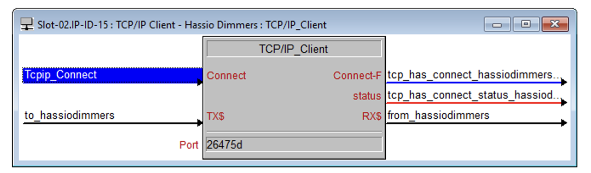
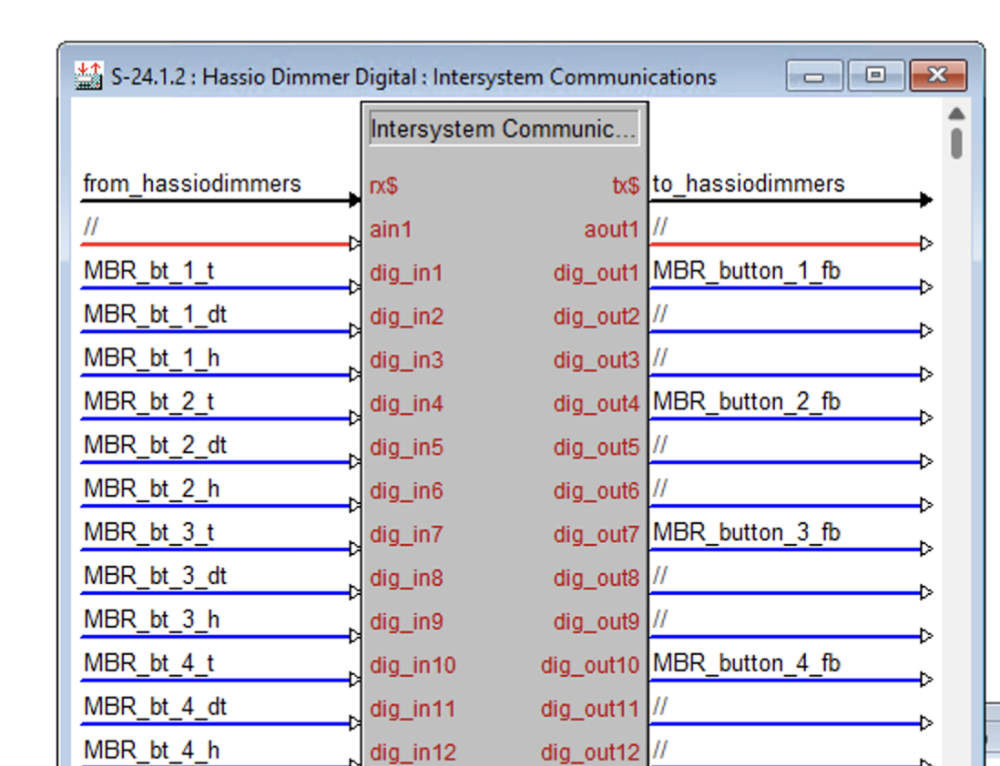
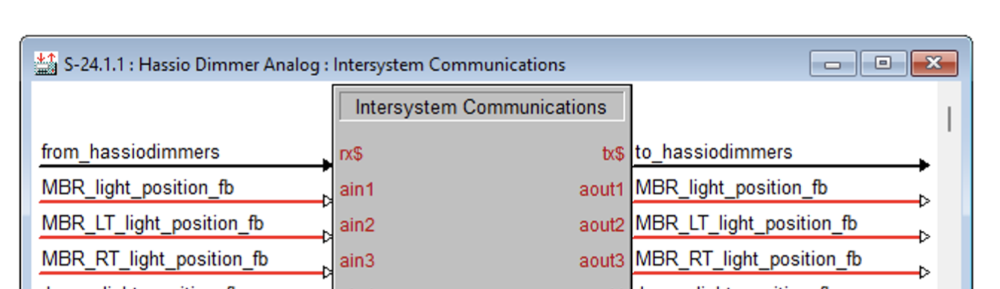
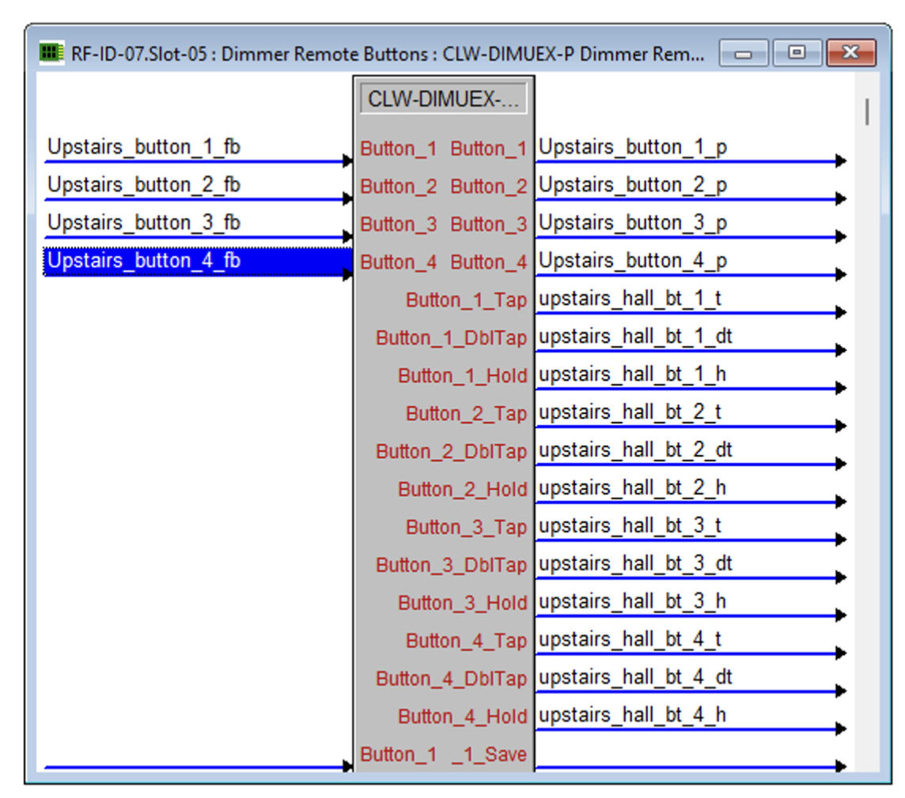

# Crestron XSIG Integration for Home Assistant

[](https://github.com/adamjs83/creston-xsig-hassio/releases)
[](https://github.com/custom-components/hacs)
[](LICENSE)

A comprehensive Home Assistant integration for Crestron control systems using the XSIG (External Signal) protocol. Control and monitor your Crestron devices directly from Home Assistant with full bidirectional communication.

## Why This Integration?

- **Complete UI Configuration** - Set up everything through the Home Assistant interface
- **No Coding Required** - Visual configuration for all entity types
- **Automatic YAML Import** - Seamlessly migrate from npope's original integration
- **Powerful Button Support** - Full keypad/dimmer support with LED feedback
- **Zero Restart Required** - Add, edit, or remove entities without restarting

## Features

### Core Capabilities

- **Bidirectional Communication** - Full support for digital, analog, and serial joins
- **UI-Based Setup** - Configure everything through Home Assistant's interface
- **YAML Import** - Automatic migration from existing YAML configurations
- **Template Sync** - Synchronize HA states to Crestron for feedback
- **Script Execution** - Run HA services when Crestron join values change
- **Auto Reconnect** - Automatic connection recovery on network issues

### Supported Platforms

- **Lights** - On/off and dimmable lights with brightness control
- **Switches** - Simple on/off control for any device
- **Climate** - HVAC thermostats and floor warming systems
- **Covers** - Shades, blinds, and curtains with position control
- **Media Players** - Control AV equipment with source selection
- **Sensors** - Monitor analog values (temperature, humidity, etc.)
- **Binary Sensors** - Monitor digital states (doors, motion, etc.)
- **Dimmers/Keypads** - Full Crestron keypad support with button events
- **Button Events** - Press, double-press, and hold detection

### Dimmer/Keypad Features

Complete support for Crestron keypads and dimmers:

- **Button Events** - Detect press, double-press, and hold actions
- **LED Binding** - Automatic LED feedback from any HA entity
- **LED Control** - Direct LED on/off control
- **Lighting Loads** - Optional dimmer control with single analog join
- **Auto-Sequential Joins** - Simple configuration with automatic join assignment
- **Manual Join Assignment** - Advanced mode for custom join layouts
- **2-6 Buttons** - Support for any keypad size

### Advanced Features

- **Modern Entity Naming** - Context-aware names that follow HA standards
- **Device Grouping** - Related entities grouped under parent devices
- **Entity Management** - Add, edit, remove entities via UI
- **Join Management** - Configure to_joins and from_joins through UI
- **No Hub Disruption** - Hub stays connected when managing entities
- **Dual Config Support** - YAML and UI configurations coexist

## Installation

### HACS Installation (Recommended)

1. Open HACS in Home Assistant
2. Go to **Integrations**
3. Click the three dots (⋮) → **Custom repositories**
4. Add: `https://github.com/adamjs83/creston-xsig-hassio`
5. Category: **Integration**
6. Click **Add**
7. Find **Crestron XSIG Integration** and click **Download**
8. Restart Home Assistant

### Manual Installation

1. Copy `custom_components/crestron` to your `config/custom_components/` directory
2. Restart Home Assistant

## Quick Start

### New Users

1. Go to **Settings** → **Devices & Services** → **Add Integration**
2. Search for **Crestron XSIG**
3. Enter your XSIG port (default: 16384)
4. Click **Submit**
5. Use the **Configure** button to add entities

### Migrating from npope's Integration

If you're coming from the original npope integration with YAML configuration:

1. **Install this integration** (see Installation above)
2. **Keep your existing YAML** - Don't remove it yet!
3. **Restart Home Assistant**
4. **Automatic import** - Your configuration will be imported automatically
5. **Test everything** - Verify all devices work as expected
6. **Optional cleanup** - Remove `crestron:` from `configuration.yaml` and restart

**What gets imported:**
- ✅ Port configuration
- ✅ to_joins (HA → Crestron sync)
- ✅ from_joins (Crestron → HA actions)
- ✅ All settings and templates

**What stays in YAML:**
- Platform entities (lights, switches, climate, etc.)
- You can migrate these to UI configuration over time
- Both YAML and UI entities coexist peacefully

## Configuration

### UI Configuration (Recommended)

After adding the integration, click **Configure** to access:

#### Entity Management

Add entities through the UI - no YAML needed:

- **Covers** - Window shades/blinds with position control
- **Binary Sensors** - Digital state monitoring (doors, motion, etc.)
- **Sensors** - Analog values with units and divisor support
- **Switches** - Simple on/off devices
- **Lights** - Lighting with optional brightness control
- **Climate** - HVAC and floor warming thermostats
- **Media Players** - AV equipment control
- **Dimmers/Keypads** - Crestron keypads with button events

#### Join Management

Configure join synchronization:

- **to_joins** - Send HA states to Crestron for feedback
- **from_joins** - Execute HA services when Crestron triggers

### YAML Configuration (Optional)

YAML configuration still works for backward compatibility:

```yaml
# Basic hub setup
crestron:
  port: 16384  # Match your XSIG symbol port

  # Sync HA states to Crestron
  to_joins:
    - join: d1
      entity_id: light.kitchen
    - join: a1
      entity_id: light.kitchen
      attribute: brightness

  # React to Crestron triggers
  from_joins:
    - join: d100
      script:
        - service: light.toggle
          target:
            entity_id: light.kitchen
```

See the **Platform Configuration** section below for YAML entity examples.

## Dimmer/Keypad Configuration

Crestron keypads and dimmers are configured exclusively through the UI.

### Adding a Dimmer/Keypad

1. Go to **Settings** → **Devices & Services** → **Crestron XSIG**
2. Click **Configure**
3. Select **Add Dimmer/Keypad**
4. Choose configuration mode:
   - **Auto-Sequential** (recommended) - Specify base join, system assigns rest
   - **Manual** (advanced) - Specify each join individually

### Auto-Sequential Join Assignment

The easiest way to configure keypads. You specify one base join, and the system automatically assigns sequential joins for all buttons.

**How it works:**
- Each button uses 3 sequential digital joins (press, double-press, hold)
- LEDs use the same joins as button presses (but opposite direction)
- Optional lighting load uses a separate analog join

**Example:** 4-button keypad with base join d10
```
Button 1: d10 (press), d11 (double), d12 (hold)
Button 2: d13 (press), d14 (double), d15 (hold)
Button 3: d16 (press), d17 (double), d18 (hold)
Button 4: d19 (press), d20 (double), d21 (hold)
Lighting load: a50 (if configured)
```

**Total joins used:**
- 2 buttons = 6 joins (d10-d15)
- 3 buttons = 9 joins (d10-d18)
- 4 buttons = 12 joins (d10-d21)
- 5 buttons = 15 joins (d10-d24)
- 6 buttons = 18 joins (d10-d27)

### What Gets Created

When you add a dimmer/keypad, these entities are created automatically:

#### Event Entities (one per button)
Fire events for button actions: `press`, `double_press`, `hold`

**Event data:**
- `device_name` - Dimmer/keypad name
- `button` - Button number (1-6)
- `action` - Action type (press/double_press/hold)

#### LED Binding Selects (one per button)
Bind keypad LEDs to any HA entity for automatic feedback:
- LED mirrors bound entity state
- Supports 15+ entity types (lights, switches, locks, covers, etc.)
- Provides Crestron-style visual feedback

#### LED Switch Entities (one per button)
Manual LED on/off control:
- Direct LED control
- Can be controlled manually or by binding

#### Light Entity (if configured)
Dimmer lighting load control:
- Standard HA light entity
- On/off and brightness control
- Single analog join (0-65535)

### Handling Button Events

You have two options for responding to button presses:

#### Option 1: Switch Manager (Recommended)

[**Switch Manager**](https://github.com/Sian-Lee-SA/Home-Assistant-Switch-Manager) is a custom component that centralizes button event handling, keeping your automations organized and clutter-free.

**Why use Switch Manager:**
- ✅ Centralized configuration in one place
- ✅ Clean UI for managing all switches/keypads
- ✅ No automation clutter
- ✅ Easy to modify button actions
- ✅ Works with any event bus integration

**Installation:**

1. Install via HACS:
   - HACS → Integrations → ⋮ → Custom repositories
   - Repository: `https://github.com/Sian-Lee-SA/Home-Assistant-Switch-Manager`
   - Category: Integration
   - Install and restart

2. Create a Switch Manager blueprint for Crestron buttons:

```yaml
blueprint:
  name: Crestron Button
  service: crestron
  event_type: crestron_button_event
  buttons:
    - name: Press
      field: action
      value: press
    - name: Double Press
      field: action
      value: double_press
    - name: Hold
      field: action
      value: hold
  identifier:
    - id: button
    - id: device_name
```

3. Configure your keypads in Switch Manager UI:
   - Settings → Devices & Services → Switch Manager
   - Add Switch → Crestron Button
   - Select device and configure actions

**Example configuration in Switch Manager:**

```yaml
# Kitchen Keypad - Button 1
Device: Kitchen Keypad
Button: 1
Actions:
  Press: Turn on kitchen lights
  Double Press: Activate kitchen scene
  Hold: Turn off all kitchen devices
LED Binding: light.kitchen
```

This approach keeps all your button configurations in one place and makes them easy to modify without touching automations.

#### Option 2: Regular Automations

You can also use standard HA automations:

```yaml
automation:
  - alias: "Kitchen Button 1 Press"
    trigger:
      - platform: event
        event_type: crestron_button_event
        event_data:
          device_name: "Kitchen Keypad"
          button: 1
          action: "press"
    action:
      - service: light.toggle
        target:
          entity_id: light.kitchen

  - alias: "Kitchen Button 1 Hold"
    trigger:
      - platform: event
        event_type: crestron_button_event
        event_data:
          device_name: "Kitchen Keypad"
          button: 1
          action: "hold"
    action:
      - service: light.turn_off
        target:
          entity_id: group.kitchen_lights
```

### LED Binding for Visual Feedback

LED binding provides automatic visual feedback on your keypads - when you bind a button's LED to a HA entity, the LED automatically mirrors that entity's state.

**Example:** Kitchen keypad controlling kitchen lights
- Bind Button 1 LED to `light.kitchen`
- When `light.kitchen` turns on → LED 1 turns on
- When `light.kitchen` turns off → LED 1 turns off
- LED stays synchronized regardless of how the light was controlled (keypad, voice, automation, etc.)

**How to configure:**
1. Navigate to your dimmer/keypad device in HA
2. Find the "LED X Binding" select entity
3. Choose the entity to bind
4. LED immediately starts tracking that entity's state

**Supported bindings:**
- Lights (on/off)
- Switches (on/off)
- Locks (locked/unlocked)
- Covers (open/closed)
- Climate (heating/cooling/idle)
- Fans (on/off)
- Media Players (playing/paused)
- And more (15+ domains)

### Crestron Programming for Dimmers

In your Crestron SIMPL Windows program:

**Button Press Signals (Crestron → HA):**
```
Button 1 Press   → XSIG Digital Join d10
Button 1 Double  → XSIG Digital Join d11
Button 1 Hold    → XSIG Digital Join d12
```

**LED Feedback Signals (HA → Crestron):**
```
Button 1 LED     → XSIG Digital Join d10 (same as press join)
```

**Lighting Load (if configured):**
```
Dimmer Level (HA → Crestron) → XSIG Analog Join a50
Dimmer Feedback (Crestron → HA) → XSIG Analog Join a50 (same join)
  0 = Off
  1-65535 = On with brightness
```

**Important notes:**
- Button press and LED feedback use the **same join numbers** but are separate signals (different directions)
- Only the **press join** is used for LED feedback (not double or hold)
- Lighting load uses a **single analog join** - no separate on/off join needed

## Platform Configuration

### Light

**UI Configuration:**
Settings → Devices & Services → Crestron → Configure → Add Light

**YAML Configuration:**
```yaml
light:
  - platform: crestron
    name: Kitchen Light
    join: d1                    # On/off digital join
    brightness_join: a1         # Optional: brightness (0-255)
```

### Switch

**UI Configuration:**
Settings → Devices & Services → Crestron → Configure → Add Switch

**YAML Configuration:**
```yaml
switch:
  - platform: crestron
    name: Fountain Pump
    switch_join: d10
```

### Climate (Thermostat)

**UI Configuration:**
Settings → Devices & Services → Crestron → Configure → Add Climate

**YAML Configuration (Standard HVAC):**
```yaml
climate:
  - platform: crestron
    name: Living Room HVAC
    is_on_join: d20            # System on/off
    heat_sp_join: a20          # Heat setpoint (tenths, e.g., 720 = 72.0°F)
    cool_sp_join: a21          # Cool setpoint
    reg_temp_join: a22         # Current temperature
    mode_heat_join: d21        # Mode: Heat
    mode_cool_join: d22        # Mode: Cool
    mode_auto_join: d23        # Mode: Auto
    mode_off_join: d24         # Mode: Off
    fan_on_join: d25           # Fan: On
    fan_auto_join: d26         # Fan: Auto
```

**YAML Configuration (Floor Warming):**
```yaml
climate:
  - platform: crestron
    name: Bathroom Floor Heat
    floor_mode_join: a30       # Set mode: 1=Off, 2=Heat
    floor_mode_fb_join: a31    # Mode feedback
    floor_sp_join: a32         # Setpoint (tenths)
    floor_sp_fb_join: a33      # Setpoint feedback
    floor_temp_join: a34       # Current temperature
```

### Cover (Shades/Blinds)

**UI Configuration:**
Settings → Devices & Services → Crestron → Configure → Add Cover

**YAML Configuration:**
```yaml
cover:
  - platform: crestron
    name: Living Room Shade
    join: d30                  # Open command
    is_opening_join: d31       # Optional: opening state
    is_closing_join: d32       # Optional: closing state
    is_closed_join: d33        # Optional: closed state
    stop_join: d34             # Optional: stop command
    pos_join: a30              # Optional: position (0-100)
```

### Media Player

**UI Configuration:**
Settings → Devices & Services → Crestron → Configure → Add Media Player

**YAML Configuration:**
```yaml
media_player:
  - platform: crestron
    name: Living Room TV
    join: d40                  # Power
    mute_join: d41             # Mute
    volume_join: a40           # Volume level
    source_number_join: a41    # Source selection
    sources:
      - name: Cable
      - name: Blu-ray
      - name: AppleTV
      - name: Streaming
```

### Sensor

**UI Configuration:**
Settings → Devices & Services → Crestron → Configure → Add Sensor

**YAML Configuration:**
```yaml
sensor:
  - platform: crestron
    name: Outdoor Temperature
    value_join: a50
    divisor: 10                # Optional: divide by 10 (for tenths)
    unit_of_measurement: "°F"
```

### Binary Sensor

**UI Configuration:**
Settings → Devices & Services → Crestron → Configure → Add Binary Sensor

**YAML Configuration:**
```yaml
binary_sensor:
  - platform: crestron
    name: Front Door
    join: d50
    device_class: door         # Optional: door, window, motion, etc.
```

## Crestron Programming

### XSIG Setup

In your Crestron SIMPL Windows program:

1. **Add a TCP/IP Client symbol** to your program
   - This handles the network connection to Home Assistant
   - Configure the IP address of your Home Assistant server
   - Set the port number (default: 16384) - **must match your HA configuration**

   

2. **Add an Ethernet Intersystem Communication (XSIG) symbol**
   - This symbol translates between TCP and join signals
   - Wire the TCP Client's **Connect_F** to XSIG's **Connect_F**
   - Wire the TCP Client's **Tx$** (transmit) to XSIG's **From_Client$**
   - Wire the XSIG's **To_Client$** to TCP Client's **Rx$** (receive)

3. **Connect XSIG signals to your logic**
   - Map digital, analog, and serial signals as needed
   - Connect joins to your devices, keypads, sensors, etc.

   **Digital signals example:**
   

   **Analog signals example:**
   

   **Dimmer/Keypad button example:**
   

4. **Compile and load the program**

**Important:** The port number is configured on the **TCP/IP Client symbol**, not the XSIG symbol. This port must match the port configured in your Home Assistant Crestron integration.

### Best Practice: Use Separate XSIG Symbols

**Recommended setup:** Use separate XSIG symbols for different join types, all connected to the same TCP/IP Client.

**Why separate symbols?**

When you mix analog and digital signals on the same XSIG symbol, join numbering becomes confusing. Even though digital signals appear numbered "1, 2, 3..." on the symbol, they're actually transmitted using sequential join numbers that continue after all analog signals.

**Example of the problem:**
- You attach 25 analog signals to an XSIG (a1-a25)
- Then attach 10 digital signals below them
- The digitals show as "1-10" on the XSIG symbol
- But they're actually transmitted as joins **26-35** (continuing the sequence)
- In Home Assistant, you'd need to use `d26`, `d27`, etc., not `d1`, `d2`

**Recommended approach:**
1. **XSIG #1:** Analog and Serial joins only
   - All analog signals (temperature, brightness, position, etc.)
   - All serial signals (text, strings)
   - Join numbers match what you see on the symbol (a1 = a1, a2 = a2, etc.)

2. **XSIG #2:** Digital joins only
   - All digital signals (button presses, on/off, LEDs)
   - Minimizes join numbering offset (see Digital Join Numbering below)

3. **Wire both XSIGs to the same TCP/IP Client:**
   - Both XSIG symbols share the same TCP connection
   - Each XSIG's To_Client$/From_Client$ wires to the TCP Client's Rx$/Tx$
   - Use serial join combiners if needed for multiple XSIGs

**Digital Join Numbering Rule:**

The XSIG symbol numbers signals sequentially across ALL join types. What you see labeled on the symbol (1, 2, 3...) is NOT the actual join number transmitted.

Digital joins are numbered **after all analog join slots** on that symbol, even if those analog slots are unused.

**Example - Dedicated Digital XSIG:**
- XSIG symbol has analog slots (even if unused): 1, 2, 3
- SIMPL shows "Digital 1", "Digital 2", "Digital 3"
- Actual joins transmitted: d4, d5, d6
- In Home Assistant, use: `d4`, `d5`, `d6` (not d1, d2, d3)

**To determine the offset:**
1. Count how many analog join slots appear on your XSIG symbol (even if unused)
2. Add that number to the digital label shown in SIMPL
3. Example: If symbol has 3 analog slots, "Digital 5" = `d8` in HA (5 + 3 = 8)

**Best practice:** Use a dedicated digital-only XSIG symbol with minimal analog slots to keep the offset small and predictable. This makes troubleshooting much easier.

### Join Types

- **Digital joins (d)** - Boolean values (true/false, on/off, button presses)
- **Analog joins (a)** - Numeric values (0-65535)
  - Temperature setpoints: multiply by 10 (e.g., 72.5°F = 725)
  - Brightness: 0-255
  - Position: 0-100
  - Dimmer levels: 0-65535 (0=off, 1-65535=on with brightness)
- **Serial joins (s)** - Text strings

### Join Direction

- **TO Crestron (Output)** - Home Assistant sends values to Crestron
  - LED feedback
  - Setpoints
  - State synchronization
- **FROM Crestron (Input)** - Crestron sends values to Home Assistant
  - Button presses
  - Sensor readings
  - Status feedback

Note: The same join number can be used for both directions (e.g., d10 for button press AND LED feedback).

## Troubleshooting

### Enable Debug Logging

```yaml
logger:
  default: info
  logs:
    custom_components.crestron: debug
```

### Common Issues

**Connection fails**
- Verify port number matches XSIG symbol
- Check network connectivity between HA and Crestron
- Verify firewall allows traffic on configured port

**State not updating**
- Check join numbers match between HA and Crestron
- Verify join types (digital/analog/serial) are correct
- Enable debug logging to see join updates

**Temperature values incorrect**
- Remember: temperature uses tenths (72.5°F = 725)
- Check divisor parameter in sensor configuration

**Button events not firing**
- Verify event type is `crestron_button_event`
- Check Developer Tools → Events to monitor events
- Confirm button press joins are triggering in debug logs

**LED not syncing**
- Verify LED binding is configured
- Check that bound entity exists and has valid state
- Confirm LED join matches button press join

## Migration Guide

### From npope's Original Integration

**Step 1: Install this integration**
- Install via HACS or manually (see Installation above)
- Don't remove your existing YAML configuration yet

**Step 2: Restart and verify import**
- Restart Home Assistant
- Check for import notification
- Verify all entities still work

**Step 3: Understand what was imported**
- Port configuration → UI config entry
- to_joins → UI join management
- from_joins → UI join management
- Platform entities → Still in YAML (migrate over time)

**Step 4: Optional cleanup**
- Test everything thoroughly first
- Remove `crestron:` section from `configuration.yaml`
- Restart Home Assistant
- Dual config warning will disappear

**Step 5: Migrate platform entities (optional)**
- Platform entities can stay in YAML indefinitely
- Or migrate them to UI configuration one by one
- Both YAML and UI entities work together

### From YAML to UI Configuration

You can migrate entities from YAML to UI at your own pace:

**YAML Light:**
```yaml
light:
  - platform: crestron
    name: Kitchen Light
    join: d1
    brightness_join: a1
```

**UI Migration:**
1. Settings → Devices & Services → Crestron → Configure
2. Select "Add Light"
3. Enter name, joins
4. Click Submit
5. Remove from YAML and restart

Both configurations can coexist - migrate when convenient.

## Credits

**Original Author:** [@npope](https://github.com/npope) - [Original Integration](https://github.com/npope/home-assistant-crestron-component)

**Current Maintainer:** [@adamjs83](https://github.com/adamjs83)

Thank you to @npope for creating the foundation that made this possible!

### Enhancements in This Fork

- Complete UI configuration with Config Flow
- UI entity management for all platforms
- Automatic YAML import for seamless migration
- Full dimmer/keypad support with button events
- LED binding with automatic state synchronization
- Modern entity naming following HA standards
- Hub persistence during entity management
- Automatic entity cleanup
- Active maintenance and updates

## License

MIT License - see [LICENSE](LICENSE) file for details

## Contributing

Pull requests and issues welcome! Please test thoroughly before submitting.

## Links

- **GitHub:** https://github.com/adamjs83/creston-xsig-hassio
- **Original Integration:** https://github.com/npope/home-assistant-crestron-component
- **Home Assistant Docs:** https://www.home-assistant.io/docs/
- **Switch Manager:** https://github.com/Sian-Lee-SA/Home-Assistant-Switch-Manager
- **Issues:** https://github.com/adamjs83/creston-xsig-hassio/issues
